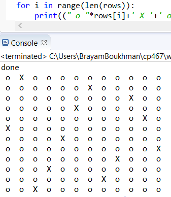

# N-Queen
solves the N-Queen problem using hill climbing, this algorithum can solve up to 500X500 in reasonable time and can be optimized further

the N-Queen problem is when Given a chessboard of n x n, the n-queen problem involves placing n queens in such a way that they cannot attack each other. The queens can attack each other if they are placed in: the same column. the same row.

this project demonstrates how one can solve this problem with clever uses of data structures and hill climbing algorithum 

